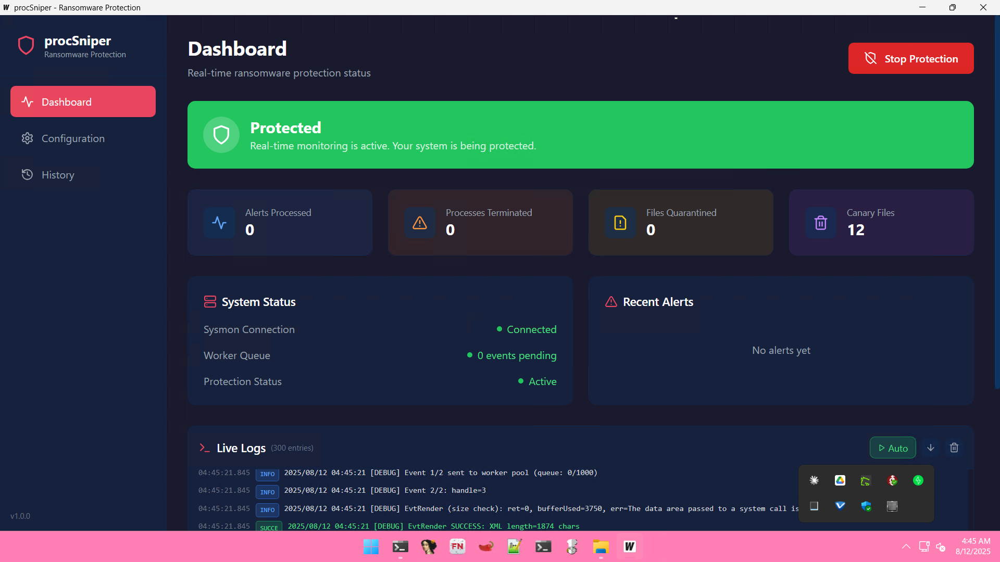
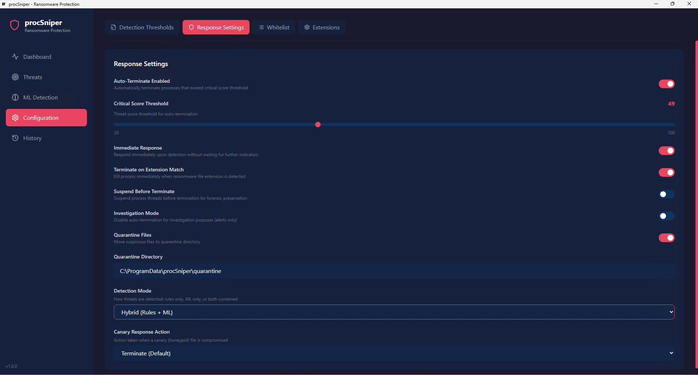
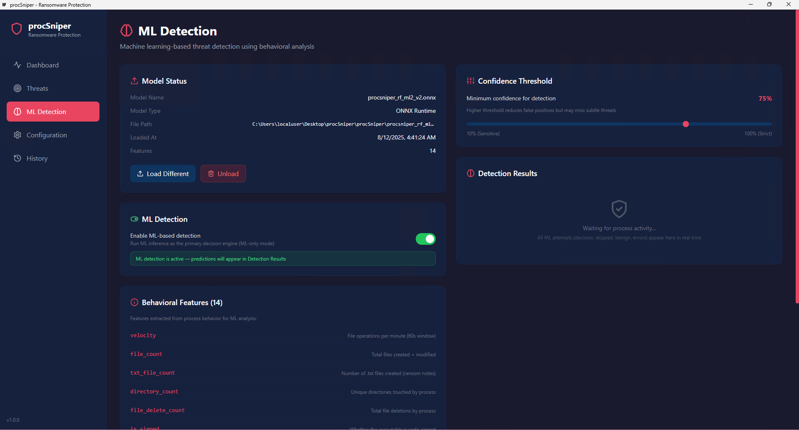
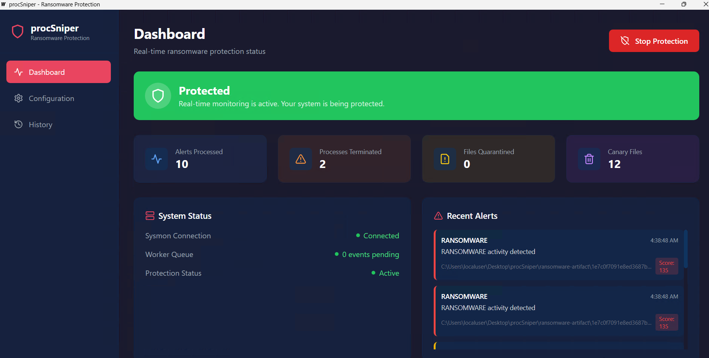
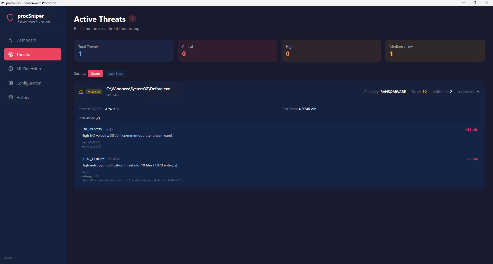
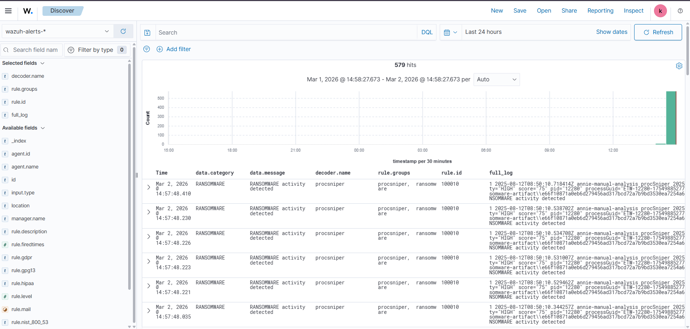

# procSniper

Windows real-time ransomware prevention powered by local ML inference. Deterministic, low-latency behavioral analysis and autonomous response — all on-host, no cloud dependency.





## Lockbit 5 Prevention Demo
[](https://youtu.be/psglMKYYdm0)

## Abstract

Ransomware prevention is a timing problem. Once encryption begins, every millisecond of delayed response means more files lost. Effective prevention requires real-time behavioral analysis with autonomous response — not post-incident detection.

procSniper is a Go-based Windows prevention system that runs local ML inference to stop ransomware before it completes its encryption cycle. The runtime ingests kernel ETW process and file activity, correlates Windows Security log signals for privilege and API abuse patterns, and continuously accumulates per-process behavioral state. A compact ONNX model running entirely on-host evaluates a fixed 14-feature vector to make sub-second prevention decisions — no cloud round-trips, no data leaving the endpoint, no latency from external inference pipelines.

The prevention architecture is mode-aware. In `rules_only`, threat scoring and rule indicators drive alerts and response policy. In `hybrid`, rule-path alerts remain active while ML inference is added after feature-gate conditions are met. In `ml_only`, rule indicators continue to accumulate as ML features, but rule-based fallback alerts are intentionally disabled, making ML the sole decision path once gate and threshold requirements are satisfied.

The current recommended model line (v2) is a 2-class ONNX model (`benign`, `ransomware`) with repository-tracked threshold guidance (`0.08`) and quality artifacts in `ml-2/models/model_metadata.json` and `ml-2/models/procsniper_rf_ml2_v2_quality_report.md`. Reported validation and test results show high ransomware recall with bounded benign false-positive rate under the project evaluation setup, but these numbers are evaluation-context results rather than universal guarantees; deployment outcomes still depend on dataset representativeness, threshold calibration, and attacker adaptation.

For defenders, this translates into practical host-level prevention capability with explicit tradeoff controls: real-time behavioral monitoring, local ML inference for autonomous process termination and suspension, configurable `rules_only`/`hybrid`/`ml_only` operation, canary-backed response actions, and clear operational boundaries around low-and-slow campaigns, network-only visibility gaps, and kernel- or firmware-level threats outside current userland scope.


## Why Local ML Inference + Hybrid Mode



Local ML inference is the core of procSniper's prevention capability. The ONNX model runs entirely on-host with zero cloud dependency, enabling sub-second autonomous response. `hybrid` mode exists for teams that want ML-driven prevention without giving up deterministic rule-path alerts.

| Mode | Primary decision path | Rule fallback behavior | Typical use |
|---|---|---|---|
| `rules_only` | Rule indicators and threat scoring | Not applicable | Baseline deterministic prevention |
| `hybrid` | Rules plus local ML inference after gate passes | Rule alerts still emit when ML does not decide | Balanced prevention with analyst visibility |
| `ml_only` | ML is sole decision-maker after gate passes | No rule-based fallback alerts | ML-first autonomous prevention |

Important behavior:
- With `--ml` and no explicit mode, CLI defaults to `ml_only`.
- Without `--ml`, mode falls back to configured mode, otherwise `rules_only`.
- `hybrid` and `ml_only` require `--ml <model_path>`.

## Prevention Pipeline




The prevention pipeline is designed to stop ransomware before it completes its encryption cycle:

1. **Kernel ETW stream** captures process and file activity in near real time.
2. **Security log consumer** correlates suspicious privilege/API patterns (for example backup API abuse workflows).
3. **Rule indicators** accumulate threat context (velocity, entropy, extension behavior, privilege abuse, canary compromise).
4. **Feature extraction** builds a fixed 14-dimensional vector per process.
5. **ML gate** checks minimum non-zero feature count (`--ml-min-indicators`) before inference.
6. **Local ONNX inference** evaluates malicious probability and class label entirely on-host.
7. **Autonomous response** terminates or suspends malicious processes based on category and policy — preventing further damage.

Canary role:
- Canary compromise remains a high-confidence prevention signal and can trigger immediate autonomous response (terminate/suspend) depending on `--canary-response` or config settings.

## Local ML Inference Engine

Feature contract:
- Runtime and model use a fixed 14-feature vector.
- Feature ordering matches the model training contract.

| Index | Feature | Runtime intent |
|---:|---|---|
| 0 | `velocity` | Recent file operation rate (ops/min) |
| 1 | `file_count` | Cumulative file operations for process lifetime |
| 2 | `txt_file_count` | Text-file targeting intensity |
| 3 | `directory_count` | Directory traversal breadth |
| 4 | `file_delete_count` | Delete activity often paired with encryption workflows |
| 5 | `is_signed` | Reserved in current runtime (`0` in v1/v2 path) |
| 6 | `extension_match` | Presence of known ransomware extension behavior |
| 7 | `extension_entropy` | Entropy of extension distribution across touched files |
| 8 | `shadow_copy_delete` | Shadow copy deletion behavior signal |
| 9 | `browser_credential_access` | Browser credential access signal |
| 10 | `browser_history_access` | Browser history access signal |
| 11 | `ssh_key_access` | SSH key path access signal |
| 12 | `lsass_access` | LSASS access behavior signal |
| 13 | `system_info_queries` | System reconnaissance command signal |

ONNX runtime behavior:
- Inference backend supports both 2-class and 3-class model outputs.
- Session initialization probes 3-class output and falls back to 2-class when needed.
- Runtime prediction payload remains shape-stable for downstream consumers, with stealer probability `0` for 2-class models.

Recommended model for current ops examples:
- `models/procsniper_rf_ml2_v2.onnx`


## Prevention Modes and Response Semantics

### Mode semantics

| Mode | Rule indicator accumulation | Local ML inference | Prevention behavior |
|---|---|---|---|
| `rules_only` | Yes | No | Rule-driven alerts and response (ThreatMedium and above) |
| `hybrid` | Yes | Yes, after gate passes | ML prevention + rule fallback when ML does not decide |
| `ml_only` | Yes (as ML feature source) | Yes, after gate passes | ML-only autonomous prevention |

### ML decision mapping

| ML label | Category | Decision score | Auto-response policy |
|---|---|---:|---|
| `ransomware` | `RANSOMWARE` | 100 | terminate-eligible |
| `stealer` | `STEALER` | 30 | alert-only |
| `benign` | none | 0 | no ML decision alert |

### Tested ransomware prevention results

| Family | `ml_only` | `hybrid` |
|---|---|---|
| `conti` | flagged | prevented (terminated) |
| `lockbit` | prevented (terminated) | prevented (terminated) |
| `lockbit 5` | flagged | prevented (terminated) |

Canary response policy controls:
- `terminate`
- `suspend`
- `alert_only`

## Quick Start (CLI + GUI)

### Prerequisites

- Windows 10/11
- Administrator privileges for full protect-mode coverage
- `[onnxruntime.dll](model/onnxruntime.dll)` available in a runtime lookup location
- Go 1.22+ for source builds
- No Sysmon dependency for core runtime telemetry path

### ONNX Runtime DLL (`model/onnxruntime.dll`)

- `[onnxruntime.dll](model/onnxruntime.dll)` is the native ONNX Runtime library used by procSniper's ML backend to load and run ONNX models.
- It is required for `protect --ml ...` and `ml-test`. If missing, model initialization fails.

How to use it:
1. Easiest path: use a model in the same folder as the DLL.

```powershell
.\procSniper.exe protect `
  --ml model/procsniper_rf_ml2_v2.onnx `
  --detection-mode hybrid `
  --ml-confidence 0.08 `
  --ml-min-indicators 3
```

2. If your model is elsewhere (for example `models/...`), place `onnxruntime.dll` in any loader lookup location:
- same directory as `procSniper.exe` (or `build/bin/procSniper-gui.exe`)
- same directory as the model passed via `--ml`
- current working directory as `onnxruntime.dll`
- any directory listed in `PATH`

Quick verification:

```powershell
.\procSniper.exe ml-test --model model/procsniper_rf_ml2_v2.onnx
```

### Build CLI

```bash
go build -tags "!gui" .
```

### CLI protection examples

Rules-only:

```powershell
.\procSniper.exe protect
```

Hybrid (rules plus ML):

```powershell
.\procSniper.exe protect `
  --ml models/procsniper_rf_ml2_v2.onnx `
  --detection-mode hybrid `
  --ml-confidence 0.07 `
  --ml-min-indicators 3 `
  --canary-response suspend
```

ML-only:

```powershell
.\procSniper.exe protect `
  --ml models/procsniper_rf_ml2_v2.onnx `
  --detection-mode ml_only `
  --ml-confidence 0.07 `
  --ml-min-indicators 3
```

Core commands:

```powershell
.\procSniper.exe config
.\procSniper.exe ml-test --model models/procsniper_rf_ml2_v2.onnx
.\procSniper.exe version
```

### GUI workflow

Build GUI:

```bash
wails build -tags gui
```

Run GUI in development mode:

```bash
wails dev -tags gui
```

For full GUI/CLI setup details, see `docs/BUILD.md`.

### Protect mode flags

| Flag | Purpose | Default |
|---|---|---|
| `--ml PATH` | Load ONNX model and enable ML integration | disabled |
| `--ml-confidence FLOAT` | Malicious probability threshold for ML decisions | `0.75` |
| `--ml-min-indicators N` | Minimum non-zero features before ML gate fires | `4` |
| `--detection-mode MODE` | `rules_only`, `hybrid`, `ml_only` | auto-resolved |
| `--canary-response ACT` | `terminate`, `suspend`, `alert_only` | config value or `terminate` |

Threshold note:
- The v2 quality artifacts recommend `0.08`; set this explicitly when using `procsniper_rf_ml2_v2`.


## Wazuh SIEM Integration



procSniper forwards all prevention alerts to a remote syslog server in RFC 5424 format, enabling native integration with Wazuh and other SIEMs for centralized visibility into prevention actions across endpoints.

### Syslog Configuration

Enable syslog forwarding in `config/ransomware_extensions.json`:

```json
"alert_settings": {
    "send_syslog": true,
    "syslog_server": "192.168.1.100",
    "syslog_port": 514,
    "syslog_protocol": "udp",
    "syslog_facility": 20,
    "syslog_tag": "procSniper",
    "verbose_logging": true
}
```

| Setting | Default | Description |
|---|---|---|
| `send_syslog` | `false` | Enable/disable syslog forwarding |
| `syslog_server` | `""` | Syslog server IP or hostname |
| `syslog_port` | `514` | Syslog destination port |
| `syslog_protocol` | `"udp"` | Transport protocol (`udp` or `tcp`) |
| `syslog_facility` | `20` | RFC 5424 facility code (20 = Local4) |
| `syslog_tag` | `"procSniper"` | APP-NAME in syslog header |

### Wazuh Decoder

Add the following decoder to `/var/ossec/etc/decoders/procsniper_decoder.xml`:


### Wazuh Rules

Add custom rules to `/var/ossec/etc/rules/procsniper_rules.xml`:

### Wazuh Agent Configuration

On the Windows agent running procSniper, add the syslog listener to `/var/ossec/etc/ossec.conf` (or configure Wazuh manager to receive syslog directly):

```xml
<ossec_config>
  <remote>
    <connection>syslog</connection>
    <port>514</port>
    <protocol>udp</protocol>
  </remote>
</ossec_config>
```

Restart the Wazuh manager after adding decoders and rules:

```bash
systemctl restart wazuh-manager
```

## Limitations

- Low-and-slow campaigns can delay signal accumulation and ML gate readiness, potentially delaying prevention response.
- This architecture focuses on host-level behavioral prevention and does not provide dedicated network IDS coverage.
- Kernel-mode, boot-level, and firmware-resident threats are outside current userland prevention scope.
- Local ML model quality depends on dataset representativeness, environment drift, and threshold maintenance.
- Some optional integration-quality workflows rely on datasets that are not bundled in this repository by default.

## Responsible Use

procSniper is a defensive ransomware prevention tool intended for authorized systems, research labs, and controlled exercises.

Do not use this project for unauthorized monitoring, unauthorized response actions, or illegal activity.

## Contributing

High-impact contribution areas:
- ML model quality validation and reproducibility hardening
- False-positive reduction and prevention threshold calibration
- Hybrid-mode explainability and prevention observability improvements
- Local inference performance and telemetry pipeline efficiency
- Additional safe testing and replay tooling for defender workflows
